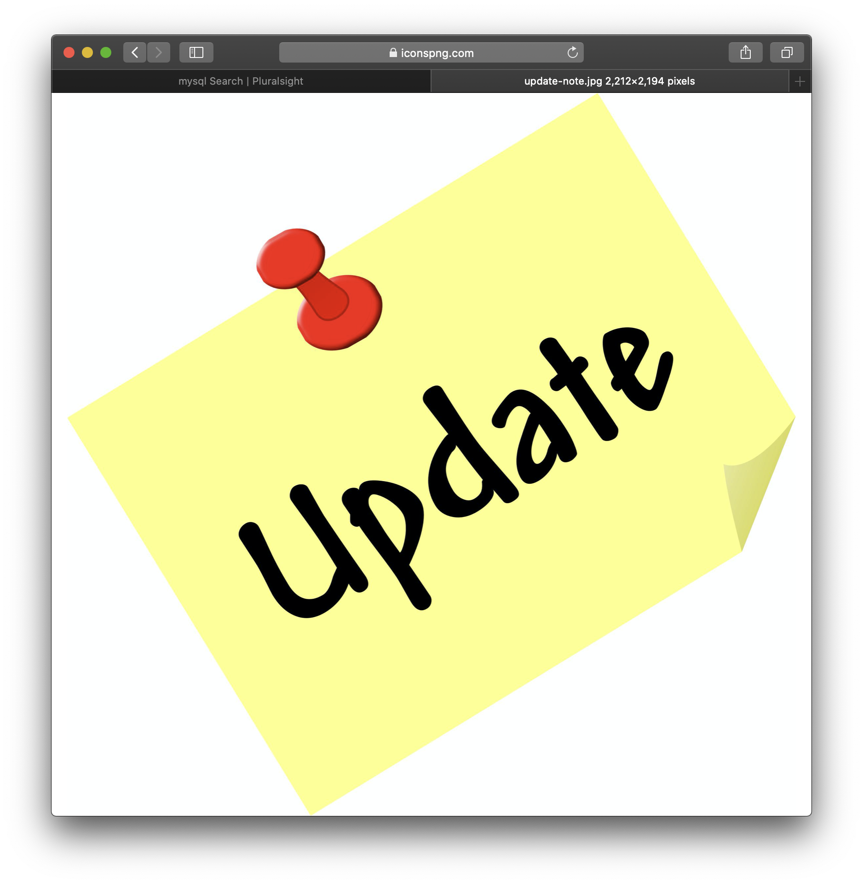

# Your Project Title
Employee Manager
<>
## Description

Employee Manager is a Command Line App that will help you manage your employee's. In this Application you can ADD, UPDATE and VIEW your existing employees departments' and roles'.

## Installation

In order to use this program, you will need to install Inquirer.
[Click Here to see Documentation](https://www.npmjs.com/package/inquirer)

## Credits

Collaborators: [Ana Luna](#) and [Aldo Carrillo](#) 

## License

<<<<<<< HEAD
MIT
=======
The last section of a good README is a license. This lets other developers know what they can and cannot do with your project. If you need help choosing a license, use [https://choosealicense.com/](https://choosealicense.com/)

---

🏆 The sections listed above are the minimum for a good README, but your project will ultimately determine the content of this document. You might also want to consider adding the following sections.

## Badges

Badges aren't _necessary_, per se, but they demonstrate street cred. Badges let other developers know that you know what you're doing. Check out the badges hosted by [shields.io](https://shields.io/). You may not understand what they all represent now, but you will in time.

## Contributing

If you created an application or package and would like other developers to contribute it, you will want to add guidelines for how to do so. The [Contributor Covenant](https://www.contributor-covenant.org/) is an industry standard, but you can always write your own.

## Tests

Go the extra mile and write tests for your application. Then provide examples on how to run them.
<node demo_db_connection.js>
>>>>>>> 929cb581bcbc32849400ed9338c2989326d87e35

---
© 2020 Talia Vazquez. All Rights Reserved.

